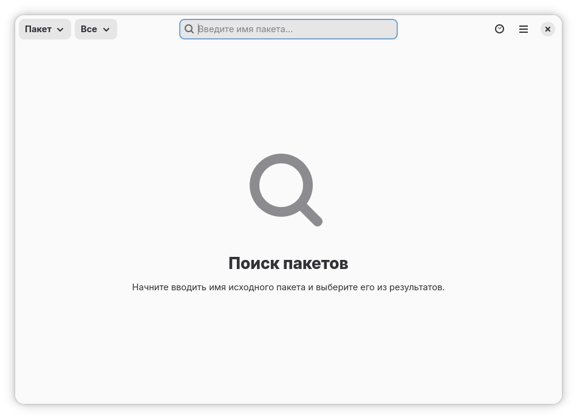
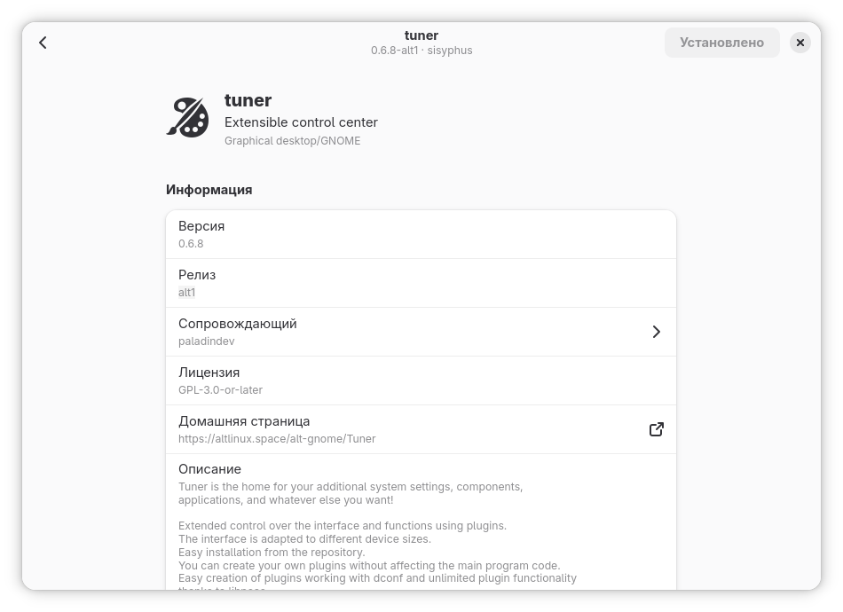
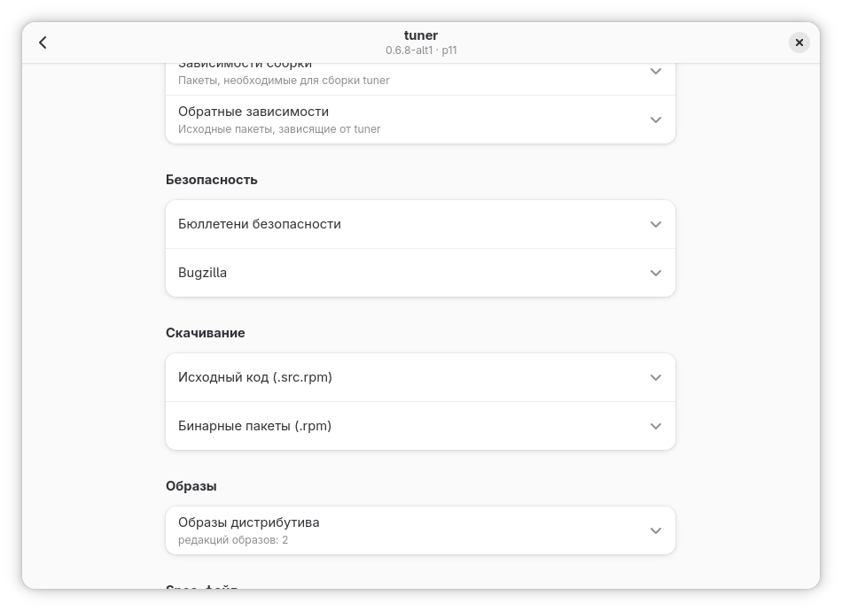
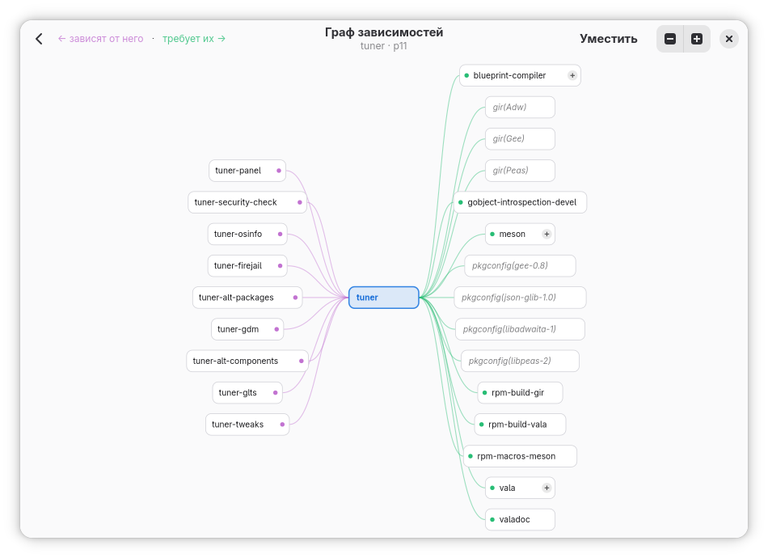
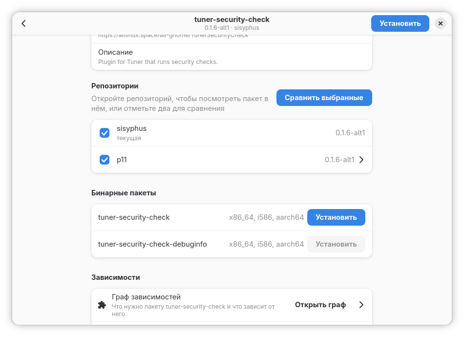

# PackageSearch

**English** · [Русский](README.ru.md)

**PackageSearch** is a GTK4/Libadwaita desktop application for ALT Linux that lets you search, inspect and install packages across the **Sisyphus**, **p11**, **p10**, **p9**, **c10f2** and **c9f2** repositories.

<div align="center">
  
</div>
<div align="center">
  
</div>
<div align="center">
  
</div>
<div align="center">
  
</div>
<div align="center">
  
</div>

## Features

- **Search** across all supported branches, with five modes:
  - by **source package** name
  - by **binary package** name
  - by **file** or path
  - by **maintainer** nickname
  - by **task** number
- Smart input handling: fuzzy ranking, Cyrillic keyboard-layout normalization, and a debounced live search
- **Recent searches** history and keyboard shortcuts
- View full **package details**:
  - Name, version, release, maintainer, group, license and homepage
  - Short and full descriptions
  - **Binary packages** built from the source
  - **Dependencies** shown as an interactive graph
  - **Versions across branches** comparison
  - Expandable **changelog**
  - **Spec file** viewer
  - **Downloads** for source and binary RPMs
  - **Distributions** that include the package
- **Security** section: closed vulnerabilities and known Bugzilla bugs, with a status filter
- **Install and update** packages from the system repository
- Native **GNOME/Adwaita UI** with fast, clean navigation

## Installation

```bash
apt-get install -y meson ninja-build pkg-config vala gettext libadwaita-devel libjson-glib-devel libsoup3.0-devel libgee0.8-devel blueprint-compiler libgtk4-devel libgee0.8-gir-devel libjson-glib-gir-devel clang cmake gettext gettext-tools gobject-introspection-devel libalt-repo-vala-1-devel libpackagekit-glib-devel
git clone https://altlinux.space/vladislavpetrukhin/PackageSearch PackageSearch
meson setup build --prefix=/usr
meson install -C build
```
